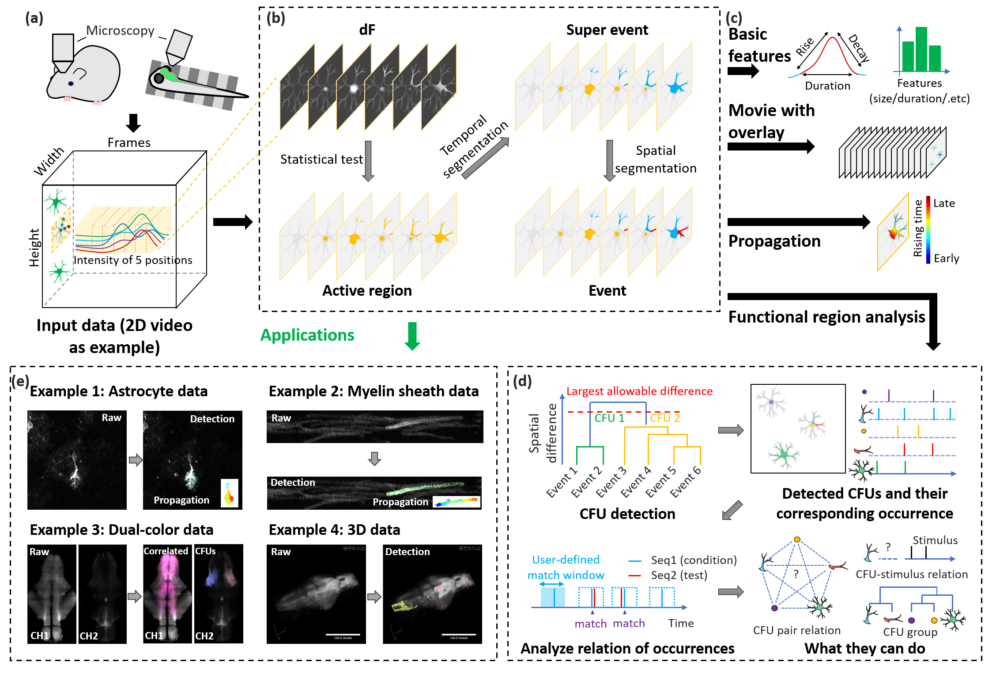
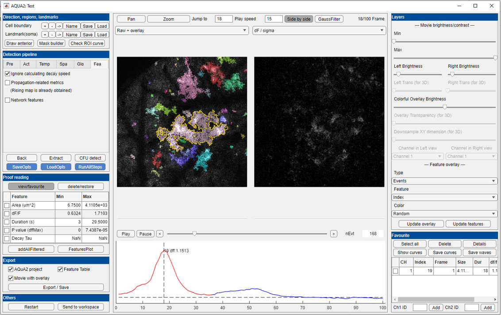
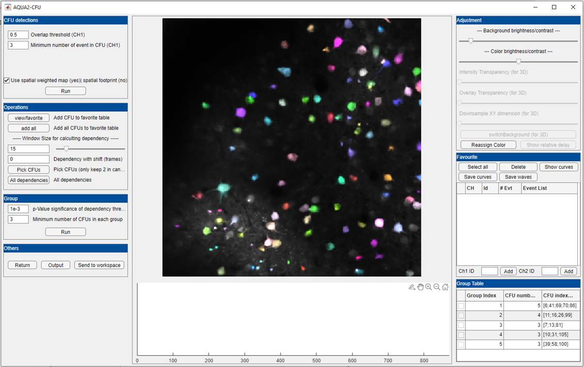

----------------------------------
AQuA2 (Activity Quantification and Analysis) is a tool for quantifying spatiotemporal signals across biosensors, cell types, organs,  animal models and imaging modalities of biological fluorescent imaging data. AQuA can be pronounced as /ˈɑː.kwə/.

If you have any feedback or issue, you are welcome to either post issue in Issues section or send email to yug@tsinghua.edu.cn (Guoqiang Yu at Tsinghua University).

- [More about AQuA2](#more-about-aqua)
  - [Potential Input Data](#potential-input-data)
  - [Detection Pipeline](#detection-pipeline)
  - [Functional unit analysis](#functional-unit-analysis)
  - [Output Features](#output-features)
  - [Graphical User Interface for Event Detection](#graphical-user-interface-for-event-detection)
  - [Graphical User Interface for CFU Module](#Graphical-User-Interface-for-CFU-Module)
- [Download and installation](#download-and-installation)
  - [MATLAB GUI](#matlab-gui)
  - [MATLAB Without GUI](#matlab-without-gui)
  - [Fiji plugin](#fiji-plugin)
- [Getting started](#getting-started)
- [Example datasets](#example-datasets)
- [Reference](#reference)
- [Updates](#updates)

# More about AQuA

## Potential Input Data
* In vivo and ex vivo
* Neuron, astrocyte, oligodendrocyte 
* Calcium, ATP, NE, GABA, dopamine
* 2D and 3D
* Single-color and dual-color 
* And more

## Detection Pipeline
* Preprocessing - dF
* Statistical test - Active region
* Temporal segmentation - Super events
* Spatial segmentation - Events

## Functional unit analysis
* Consensus Functional Unit (CFU) definition: 
  - If one spatial region generates repeated signal events, it is more likely to be a functional unit, and we refer to such a region as a CFU. This concept offers greater flexibility compared to ROIs, allowing each occurrence of signals to have different sizes, shapes, and propagation patterns while maintaining consistent spatial foundations. The derived CFU could be single cell, cell group, tissue, or organ.
* CFU identification
* Interaction analysis between CFUs
* CFU grouping

## Output Features
- Event-level features
  - Location of events
  - Basic features of individual events, including voxel set, duration, area size, average curve of event's spatial footprint, average dF curve of spatial footprint, rising time, peak p-value, area under the curve (AUC), and others.
  - Propagation-related features, including propagation speed, propagation map, and propagation trend in various directions.
  - Network features, which involve the distances between events and user-defined regions (e.g., cell regions or landmarks), as well as assessing the co-occurrence of events in spatial or temporal dimensions.
- CFU-level features
  - Individual CFU information, including the spatial map, event sequence, average curve, and average dF curve.
  - The dependency between every pair of CFUs, as well as the relative delay between two CFUs.
  - The information of CFU groups, including CFU indexes and the relative delay of each CFU.

## Graphical User Interface for Event Detection
* Similar GUI as AQuA
* Step by step guide
* Event viewer
* Feature visualizer
* Proofreading and filtering
* Side by side view
* Region and landmark tool
* And more

## Graphical User Interface for CFU Module
* Step by step guide
* Event viewer
* Feature visualizer
* Proofreading and filtering
* Side by side view
* Region and landmark tool
* And more

# Download and installation
## MATLAB GUI

1. Download latest version **[here](https://github.com/yu-lab-vt/AQuA2/archive/master.zip)**.
2. Unzip the downloaded file.
3. Start MATLAB.
4. Switch the current folder to AQuA2's folder.
5. Double click `aqua_gui.m`, or type `aqua_gui` in MATLAB command line.

We recommend MATLAB versions later than 2022b.
For 3D imaging data, we recommend to use MATLAB 2022b.

## MATLAB Without GUI
### Use aqua_batch.m file
1. Double click `aqua_batch.m` file.
2. Set the folder path 'pIn', and for each target dataset, set the parameters in `AQuA2/cfg/parameters_for_batch.csv`. Each dataset is corresponding to one parameter setting.
3. Run the file.
4. The output files will be saved in subfolders of 'pOut'.

## Fiji plugin
- Fiji plugin version of AQuA can be found **[here](https://github.com/yu-lab-vt/AQuA2-Fiji)**.

# Getting started
If you are using AQuA2 for the first time, please read
**[the step by step user guide](https://docs.google.com/presentation/d/1KgD0E8SUG3SZ61QLi0il68QYY3bpcy6Z/edit?usp=drive_link&ouid=104552898625388575115&rtpof=true&sd=true)**.

Or you can check the **[details on output files, extracted features, and parameter settings](https://docs.google.com/document/d/1mp3KjGIKosOzfy2TrVlTAvzdzEjy_fra/edit?usp=drive_link&ouid=104552898625388575115&rtpof=true&sd=true)**.

# Example datasets
You can try these real data sets in AQuA2.

**[Ex-vivo GCaMP dataset](https://drive.google.com/open?id=13tNSFQ1BFV__42TY0lZbHd1VYTRfNyfD)**

**[In-vivo GCaMP dataset](https://drive.google.com/open?id=1TjfFzlg_6BxsFX_l3-P92M5Rp_5j6wiM)**

**[GluSnFr dataset](https://drive.google.com/open?id=1XFJBE18sQTa6svXXRV1TidgNPSv-ldtY)**

# Reference
Xuelong Mi, Alex Bo-Yuan Chen, Daniela Duarte, Erin Carey, Charlotte R. Taylor, Philipp N. Braaker, Mark Bright, Rafael G. Almeida, Jing-Xuan Lim, Virginia M. Rutten, Wei Zheng, Mengfan Wang, Michael E. Reitman, Yizhi Wang, Kira E. Poskanzer, David A. Lyons, Axel Nimmerjahn, Misha B. Ahrens, Guoqiang Yu, *Fast, Accurate, and Versatile Data Analysis Platform for the Quantification of Molecular Spatiotemporal Signals*, BioRxiv 592259; doi: https://doi.org/10.1101/2024.05.02.592259. **[[Link to BioRxiv]](https://doi.org/10.1101/2024.05.02.592259)**

# Updates

**12/02/2025**
Add direct CFU viewer. IMPORTANT: Adjust opts saving format. Fix a bug in CFU.

**08/27/2025**

Add load function in CFU module to visualize batch processed data.

**08/25/2025**

Add 3D+time files imput for using `aqua_cmd_batch.m`. Improve batch output directories. 

**07/23/2025**

Add import waitbar. Enable large file(>4GB) tiff reading. Improve import process. Repair two bugs in spatial segementaion and feature extraction.

**10/06/2024:** 

Add scripts to registrate the FOV for AQuA2 results from multi-session datasets. Also add one script for comparing CFUs from two datasets with the same spatial size.

**10/04/2024:** 

Repair one bug about the feature output of global detections in batch script.

**09/26/2024:** 

Repair one bug about landmark features.

**09/18/2024:** 

Modify `aqua_cmd_batch.m` to repair one bug about outputting feature table.

**08/24/2024:** 

Fix one bug about outputting propagation features.

**08/16/2024:** 

Reuse some landmark features used in AQuA for 2D time-lapse imaging data.

**06/11/2024:** 

Add MEX files to enable spatial segmentation of AQuA2 in Mac system.

**06/05/2024:** 

Enable `aqua_cmd_batch.m` to output more features.

**05/22/2024:** 

Modify `aqua_cmd_batch.m` to enable the extraction of network features.

**05/21/2024:** 

Add `post_cfu_cmd_batch.m` to enable the CFU identification and analysis based on the saved files of `aqua_cmd_batch.m`.
